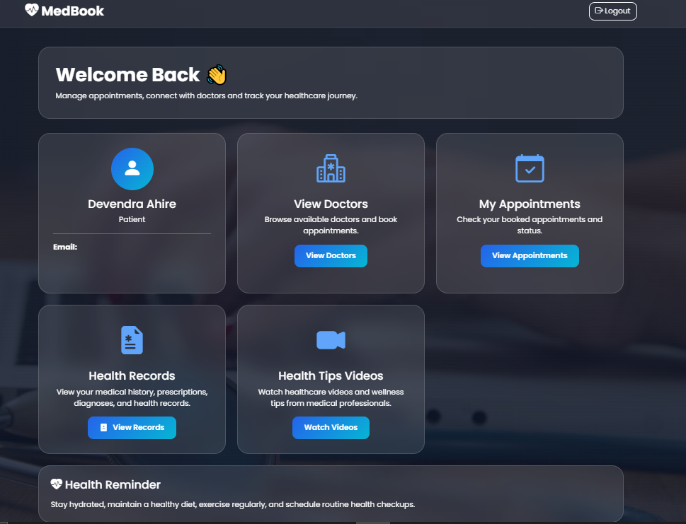
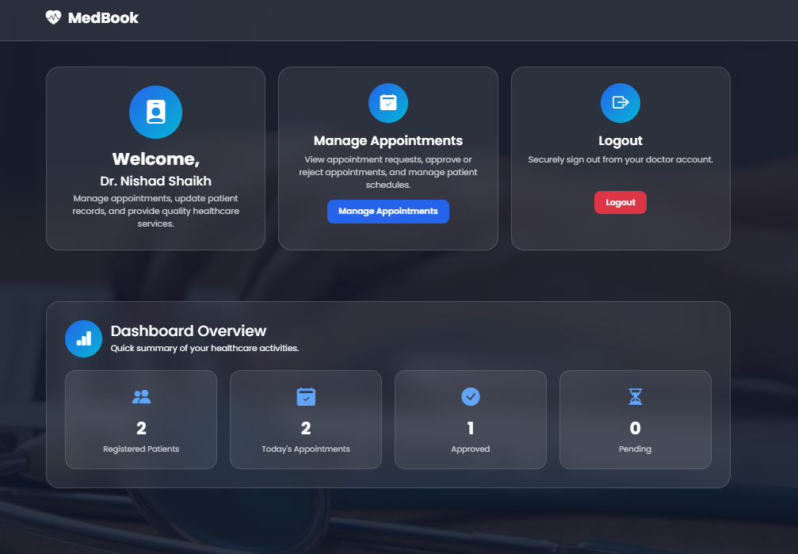
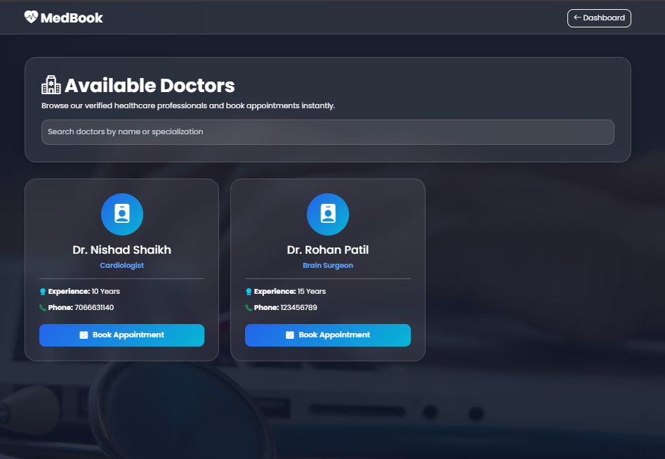
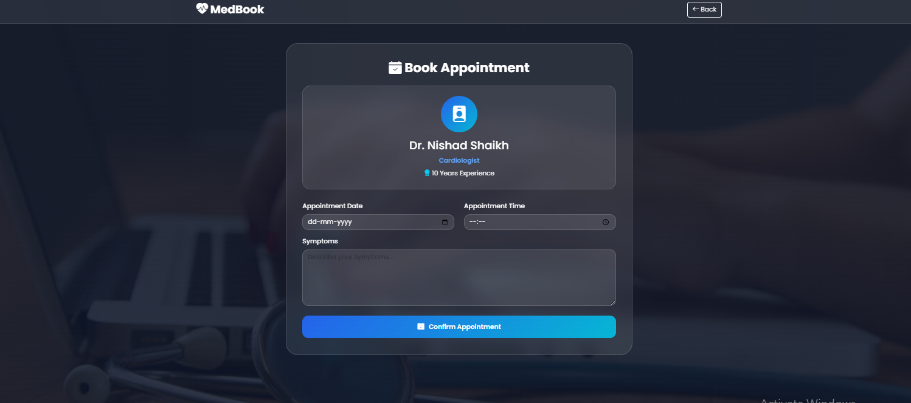
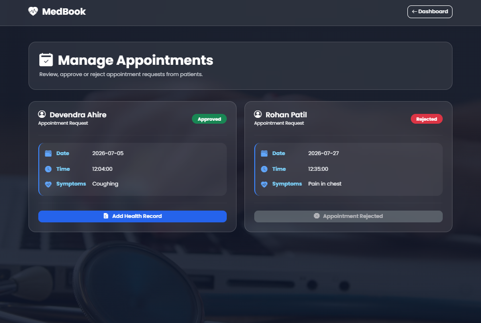
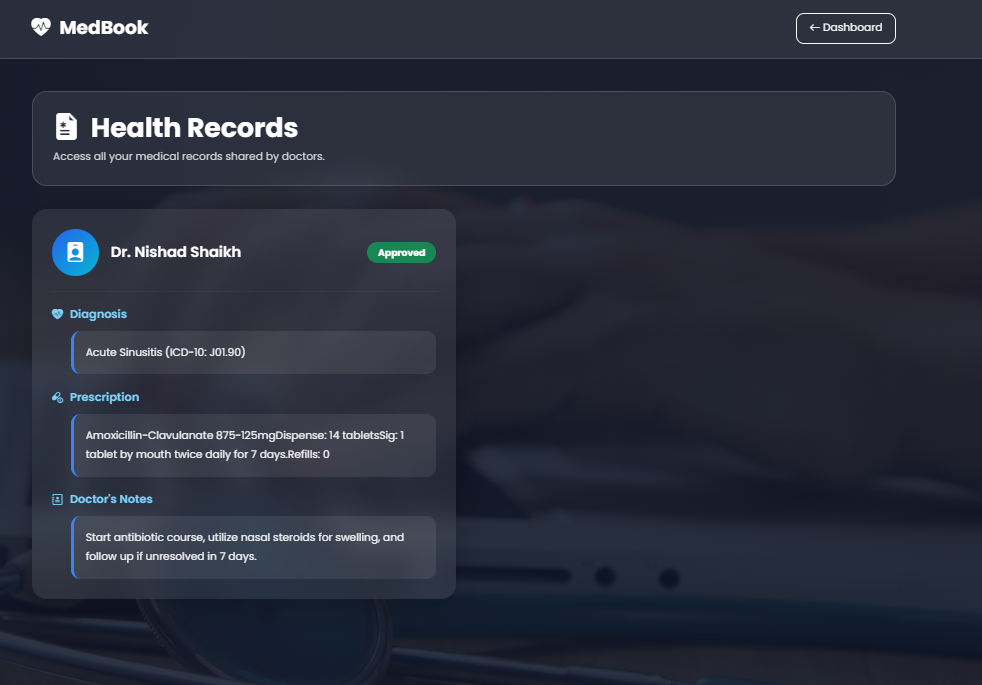

# 🏥 MedBook - Doctor Appointment & Patient Medical Record System


MedBook is a modern healthcare management web application developed using **CodeIgniter 4**, **PHP**, **Bootstrap 5**, and **MySQL**.

The system enables patients to register, book appointments with doctors, receive appointment confirmation emails, and access their medical records. Doctors can manage appointments, approve or reject bookings, maintain patient medical records, and provide healthcare resources through dynamic video and audio health tips.

---

# ✨ Features

## 👤 Authentication

* Patient Registration
* Doctor Registration
* Secure Login
* Password Hashing
* Role-Based Authentication
* Session Management
* Protected Routes

---

## 👨‍⚕️ Doctor Module

* Doctor Dashboard
* Dashboard Statistics
* View Patient Appointments
* Approve Appointments
* Reject Appointments
* Add Medical Records
* Duplicate Medical Record Prevention

### Dashboard Statistics

* Total Registered Patients
* Total Appointments
* Pending Appointments
* Approved Appointments

---

## 🧑 Patient Module

* Patient Dashboard
* View Registered Doctors
* Book Appointment
* Duplicate Appointment Slot Detection
* View Appointment Status
* View Medical Records
* Dynamic Health Tips

---

## 📧 Email Notifications

Patients automatically receive an email after successfully booking an appointment.

The confirmation email contains:

* Doctor Name
* Appointment Date
* Appointment Time
* Symptoms
* Booking Confirmation

---

## 🎥 Health Tips

Dynamic multimedia section using HTML5.

Supports:

* HTML5 Video
* HTML5 Audio

Videos and audio files are loaded dynamically from the database.

---

## 🔒 Security Features

* Password Hashing
* Session Authentication
* Role-Based Access Control
* Protected Routes
* Duplicate Appointment Prevention
* Duplicate Medical Record Prevention

---

# 🛠 Technologies Used

### Frontend

* HTML5
* CSS3
* Bootstrap 5
* JavaScript

### Backend

* PHP
* CodeIgniter 4

### Database

* MySQL

### Email

* Gmail SMTP

---

# 📂 Project Structure

```text
MedBook/
│
├── app/
│   ├── Controllers/
│   ├── Models/
│   ├── Views/
│   ├── Config/
│   └── Filters/
│
├── public/
│   ├── uploads/
│   │   ├── videos/
│   │   └── audio/
│
├── screenshots/
│   ├── login.png
│   ├── register.png
│   ├── patient_dashboard.png
│   ├── doctor_dashboard.png
│   ├── appointment_booking.png
│   ├── appointments.png
│   ├── medical_records.png
│   └── health_tips.png
│
├── sample_doctors.json
├── medbook.sql
├── composer.json
├── spark
├── README.md
└── writable/
```

---

# 📁 Additional Resources

## sample_doctors.json

The project includes a **sample_doctors.json** file as required by the case study.

It contains sample doctor information for:

* Testing
* Learning
* Understanding the expected doctor data format

> **Note:** This file is only for reference. The actual application stores doctor information inside the MySQL database.

---

# 📋 Database Tables

## users

Stores login information for both patients and doctors.

Fields

* id
* name
* email
* password
* role

---

## doctors

Stores doctor's professional information.

Fields

* id
* user_id
* specialization
* experience
* phone

---

## appointments

Stores appointment details.

Fields

* id
* patient_id
* doctor_id
* appointment_date
* appointment_time
* symptoms
* status

---

## medical_records

Stores medical records created by doctors.

Fields

* id
* appointment_id
* patient_id
* doctor_id
* diagnosis
* prescription
* notes

---

## health_tips

Stores multimedia health tips.

Fields

* id
* title
* description
* video
* audio

---

# 🚀 Installation Guide

## 1. Clone Repository

```bash
git clone https://github.com/Devendra2304/MedBook.git
```

---

## 2. Open Project

Place the project inside your local web server directory.

Example:

```text
xampp/htdocs/MedBook
```

---

## 3. Install Dependencies

```bash
composer install
```

---

## 4. Configure Environment

Rename

```text
env
```

to

```text
.env
```

Inside `.env`

```text
CI_ENVIRONMENT = development
```

---

## 5. Configure Database

Open

```text
app/Config/Database.php
```

Update the credentials.

```php
public string $hostname = 'localhost';
public string $username = 'root';
public string $password = '';
public string $database = 'medbook';
```

---

# 🗄 Database Installation

Create a database named

```text
medbook
```

Then import

```text
medbook.sql
```

---

## Using XAMPP

1. Start

* Apache
* MySQL

2. Open

```text
http://localhost/phpmyadmin
```

3. Create database

```text
medbook
```

4. Import

```text
medbook.sql
```

Default credentials

```text
Host     : localhost
Username : root
Password :
```

---

## Using MySQL Community Server + MySQL Workbench

Create the database

```sql
CREATE DATABASE medbook;
```

Open MySQL Workbench

Import

```text
medbook.sql
```

Typical credentials

```text
Host     : localhost
Username : root
Password : YOUR_PASSWORD
```

Use the same credentials inside

```text
app/Config/Database.php
```

---

# ⚠ Common MySQL Issues

## Access Denied

Example

```text
Access denied for user 'root'@'localhost'
```

### Solution

Verify:

* Database Name
* Username
* Password

inside

```text
app/Config/Database.php
```

---

## XAMPP and MySQL Community Server Installed Together

If both are installed, they may conflict because they use different MySQL services or ports.

Before running the project:

* Ensure only one MySQL service is running.
* Check the MySQL port.
* Verify the credentials match the active MySQL server.
* Restart Apache and MySQL after making changes.

---

## Port Conflict

If MySQL refuses to start:

* Stop any existing MySQL service.
* Restart the correct MySQL service.
* Verify the configured port.

---

# 📧 Gmail SMTP Configuration

Open

```text
app/Config/Email.php
```

Configure

```php
public string $fromEmail = "YOUR_EMAIL@gmail.com";
public string $fromName = "MedBook";

public string $SMTPHost = "smtp.gmail.com";
public string $SMTPUser = "YOUR_EMAIL@gmail.com";
public string $SMTPPass = "YOUR_GOOGLE_APP_PASSWORD";

public int $SMTPPort = 587;
public string $SMTPCrypto = "tls";
```

### Important

Google no longer supports normal Gmail passwords for SMTP.

Enable:

* Two-Factor Authentication

Generate a

```text
Google App Password
```

Use that App Password instead of your Gmail password.

---

# ▶ Running the Project

```bash
php spark serve
```

Open

```text
http://localhost:8080
```

---

# 🎥 Health Tips

Health tip media is loaded dynamically.

Store media inside

```text
public/uploads/videos/

public/uploads/audio/
```

Ensure the paths stored in the database match the uploaded files.

---

# 📌 Application Workflow

## Doctor

Register

↓

Login

↓

Manage Appointments

↓

Approve / Reject Appointment

↓

Add Medical Record

↓

Logout

---

## Patient

Register

↓

Login

↓

View Doctors

↓

Book Appointment

↓

Receive Confirmation Email

↓

View Appointment Status

↓

View Medical Records

↓

Logout

---

# 📸 Screenshots


---

## Patient Dashboard



---

## Doctor Dashboard



---

## View Doctors



---

## Appointment Booking UI



---

## Manage Appointments



---

## Medical Records



---

## Audio/Video Section


---

# 🧪 Tested Features

* Doctor Registration
* Patient Registration
* Role-Based Login
* Password Hashing
* Session Authentication
* Appointment Booking
* Duplicate Slot Detection
* Appointment Approval
* Appointment Rejection
* Medical Record Creation
* Duplicate Medical Record Prevention
* Email Notifications
* Health Tips
* Dashboard Statistics

---

# ⚠ Common Issues

## Composer Not Found

```text
composer : The term 'composer' is not recognized
```

**Solution**

Install Composer and restart your terminal.

---

## PHP Not Found

```text
php is not recognized
```

**Solution**

Add PHP to your system PATH.

---

## Writable Folder Permission

Ensure

```text
writable/
```

has write permission.

---

## SMTP Email Not Sending

Possible reasons:

* Incorrect App Password
* Two-Factor Authentication Disabled
* SMTP configuration incorrect

---

## Videos or Audio Not Playing

Verify:

```text
public/uploads/videos/

public/uploads/audio/
```

and ensure the database paths are correct.


---

## GitHub Push Failed

GitHub rejects files larger than **100 MB**.

Compress large media files or host them externally before pushing.

---

# 🚀 Future Enhancements

* Admin Dashboard
* Online Payments
* Search Doctors
* Doctor Profile Pictures
* Patient Profile Management
* PDF Medical Reports
* Appointment Reminders
* Video Consultation
* Dark Mode

---

# 👨‍💻 Developed By

**Devendra Ahire**

Master of Computer Applications (MCA)

GitHub Repository:

https://github.com/Devendra2304/MedBook

---

# ⭐ Support

If you found this project useful, consider giving it a ⭐ on GitHub.
